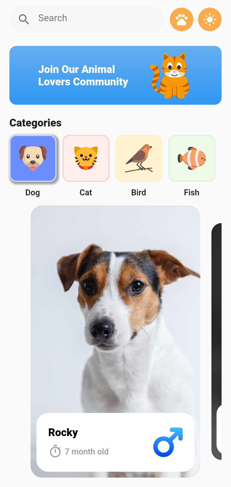
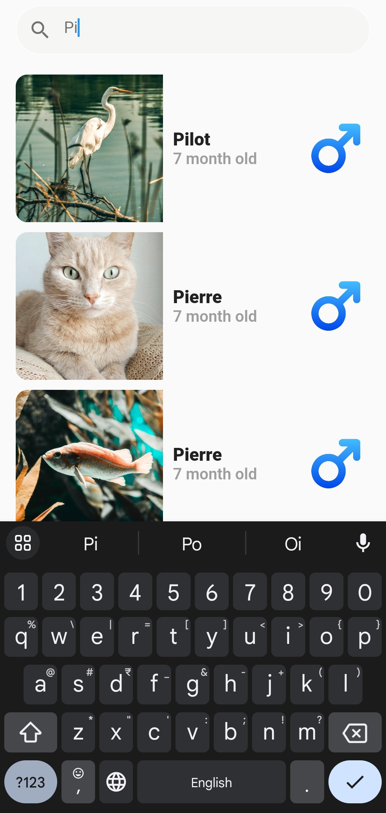
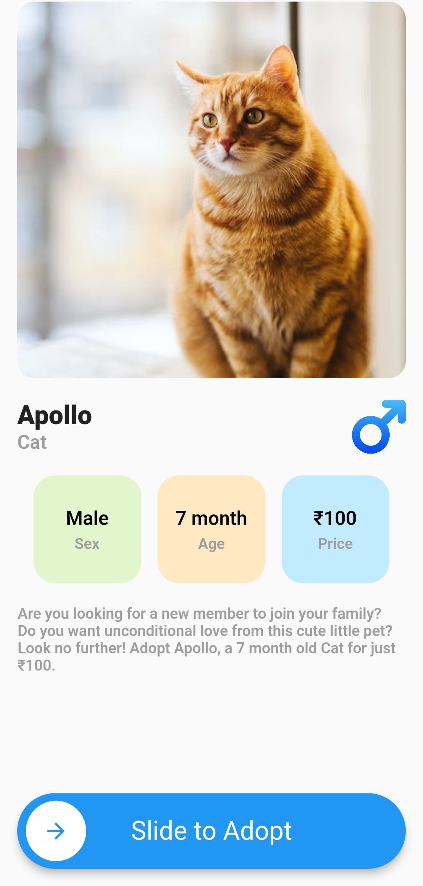
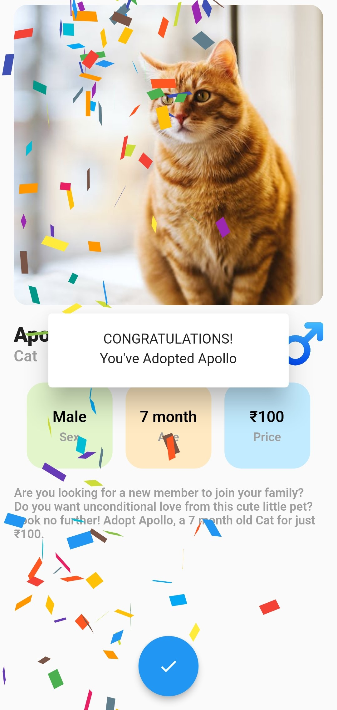
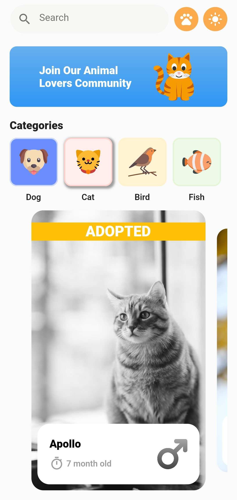
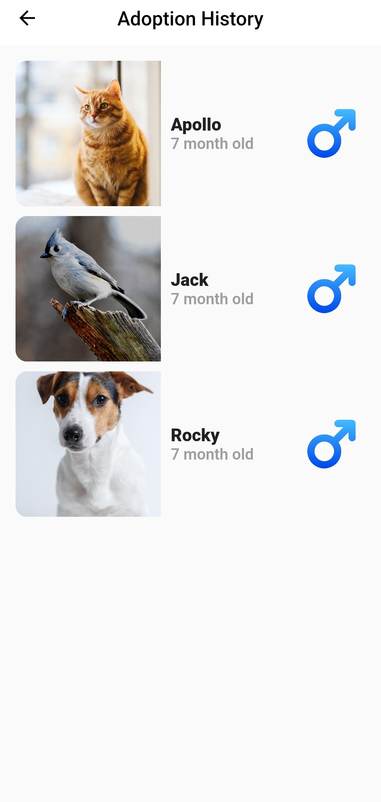
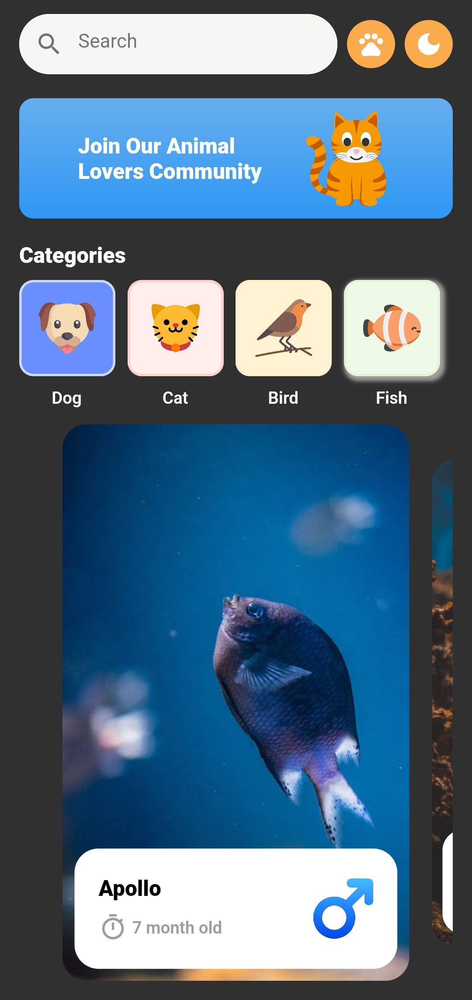

# Pet Adoption App

This is a pet adoption app built using Flutter. This example app utilizes the Domain-Driven Design (DDD) architectural pattern for organizing the codebase following describes best practices for scalable projects.

## Features

The app has the following features:

- Filter pets by category such as Dog.
- Search for pets by their name.
- View pet details including photos, age, gender and adoption fee.
- Save pet adoption history.
- Contact pet shelters and rescue organizations.

UI Inspiration from the awesome designers at CMARIX Technolabs (https://www.behance.net/gallery/163362473/Pet-Adoption-App-Design).

### Screenshots

*Home Screen - Option to filter animals based on categories. List of pet has pagination support, when user scrolls to the end of screen only then more animals are loaded.*



*Pet Search Screen - Pets can be searched by name.*



*Pet Details Screen*



*Adoption Confirmation Screen with Confetti animation*



*Home Screen with Adopted pets greyed out*



*Adoption History Screen*



*Dark Mode*



## Domain Driven Design

The app has been built using Domain Driven Design (DDD). DDD is a software development methodology that focuses on the problem domain and the business logic of the application. It aims to create software that is easy to understand, maintain and extend. The benefits of using DDD include:

- Clear separation of concerns between the presentation (UI Layer), application logic and data storage.
- Improves collaboration between developers and domain experts.
- Increased code quality and extensibility.
- Makes scaling the app easier and efficient in adding new features.

## FAQs

- **Why did you use such a complex software design for a small 3-page app?**
    - The goal here is to show the use of Domain Driven Design (DDD) principles. There are never any ‘small’ apps in production, there would be multiple developers working with Domain experts. DDD ensures there is separation of layers and changes in one layer does not affect other layers of the codebase. DDD is a perfect combination with statically typed languages like Dart for quick refactoring and especially for startups that need to add new features/updates quickly.

- **Can you show a practical example in this project describing the benefit of DDD?**
    - Currently, for this demo app the list of pets is stored locally in infrastructure/data_source/pet_data.dart file. Let’s say tomorrow we want to move this to a remote cloud database. Without DDD this could be a nightmare as changes have to be made all around the codebase. This is time-consuming and error prone. However, with DDD only place where you have to make any changes is the infrastructure layer. The application or presentation layer doesn’t care from where they're getting data, all they want is data in the right format to work with.

## Getting Started

To run the app, you will need to have Flutter installed on your machine. Clone the repository and run the following command in the project directory:

```bash
flutter run
```

## Contributing

Contributions are welcome and much appreciated. Please fork the repository and submit a pull request with your changes.
